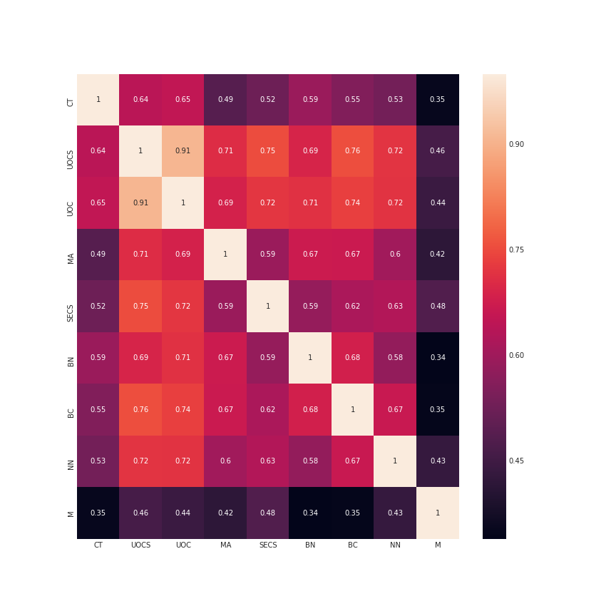

# KNN Implementation

### [Breast Cancer Winsconsin (Diagnostic) Data set](https://archive.ics.uci.edu/ml/machine-learning-databases/breast-cancer-wisconsin/breast-cancer-wisconsin.data), from UCI - Machine Learning Repository 

